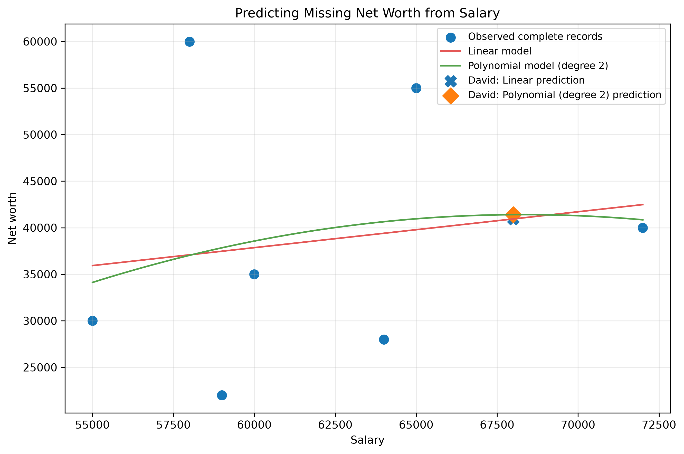
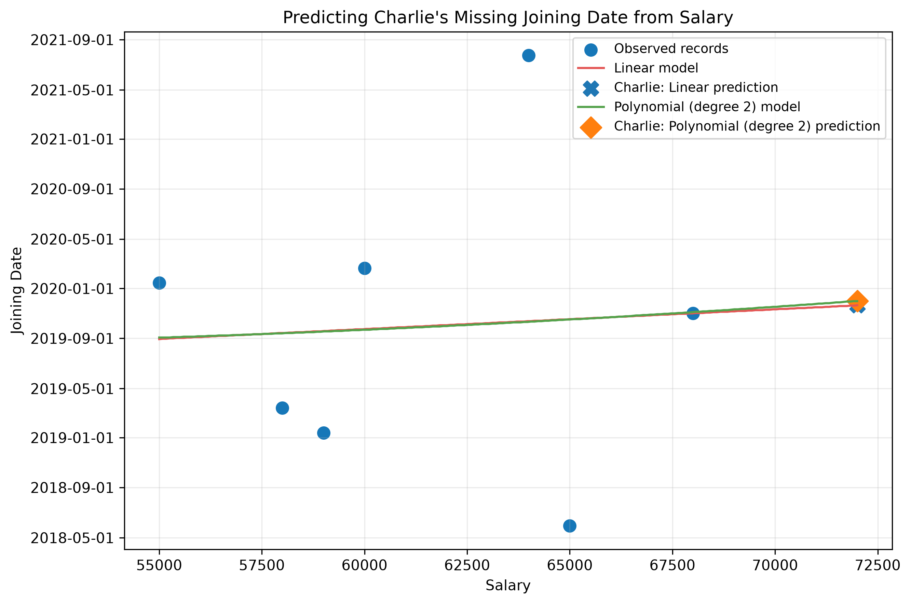
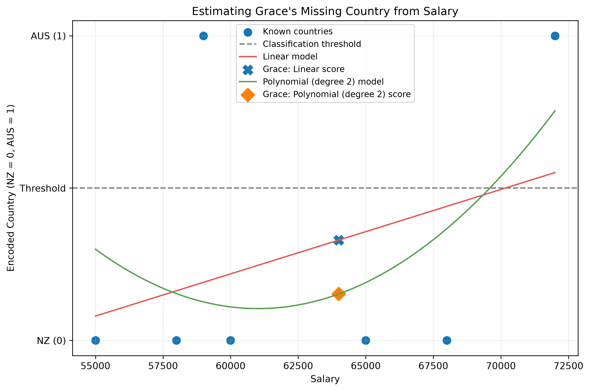
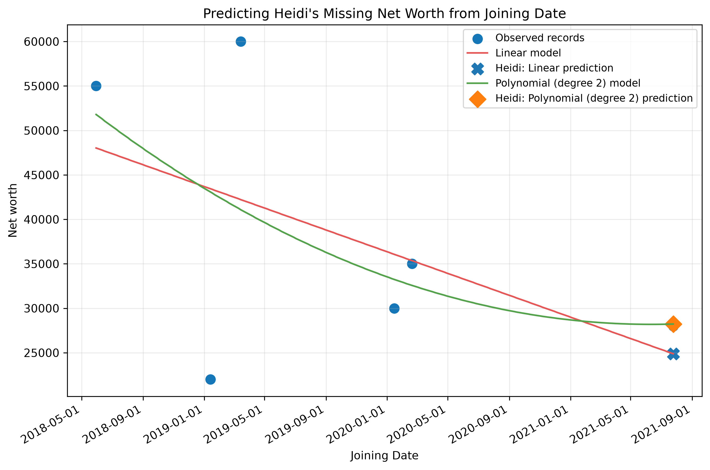
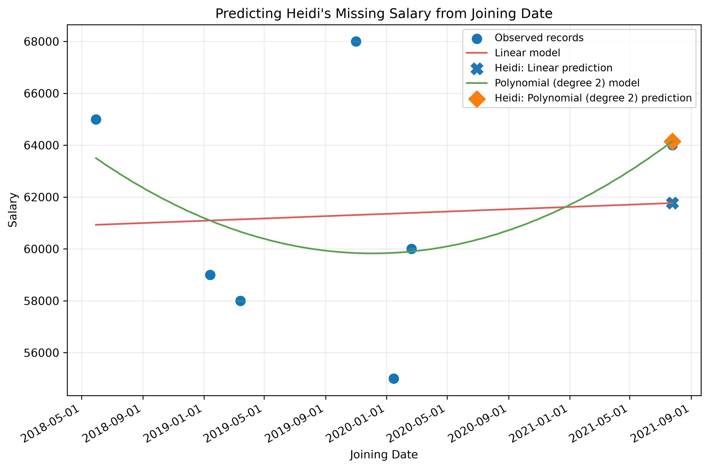
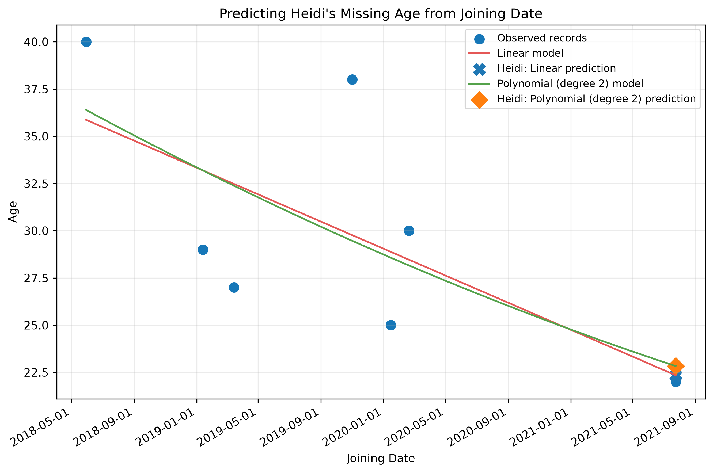

# Week 3 – Activity 2: Predicting a missing value

This activity continues the cleaning work from Activity 1. It compares ordinary
linear regression with degree-2 polynomial regression and uses the better model
to predict a missing value where the available evidence makes prediction
possible.

## Run

From the repository root:

```powershell
python .\week3\activity2\missing_value_prediction.py
```

The program reads `week3/activity1/cleaned_dataset.csv` and creates:

- `prediction_results.csv`, a compact one-row-per-missing-field comparison of
  both models, validation errors, the selected result, and interpretation;
- `completed_dataset.csv`, a presentation-ready dataset containing selected
  estimates and explicit `Observed`, `Predicted`, or `Missing` source columns;
- `regression_comparison.png`, comparing the two fitted models and predictions.

## Prediction decision

David has Age and Salary but is missing Net worth. Seven other subjects have
both Salary and Net worth, so the models predict David's Net worth from Salary.
Leave-one-out cross-validation (LOOCV) compares how well each model predicts an
observation that was excluded from training. The model with the lower LOOCV
root mean squared error (RMSE) is selected.

Heidi is missing Age, Net worth, and Salary. Because she has no usable numeric
predictor, regression cannot responsibly fill those fields. Missing ID, Name,
Country, and Join Date values are not continuous numeric targets, so these
regression models are inappropriate for them. They remain missing rather than
being invented.

## Model comparison

The result values below are generated by `missing_value_prediction.py`.

<!-- RESULTS_START -->
| Model | LOOCV MAE | LOOCV RMSE | LOOCV R² | David's predicted Net worth |
|---|---:|---:|---:|---:|
| Linear regression | 14,555.68 | 16,632.78 | -0.609 | 40,939.37 |
| Polynomial regression (degree 2) | 18,883.00 | 20,169.97 | -1.366 | 41,401.99 |

**Selected model: linear regression.** Its LOOCV RMSE of 16,632.78 is lower
than the polynomial model's 20,169.97, so it gives the better of the two tested
predictions. David's missing Net worth is therefore estimated as **40,939.37**.
<!-- RESULTS_END -->

Both regressions are used independently: each is fitted to the seven complete
records, evaluated with LOOCV, and used to predict David's missing value. The
output CSV keeps both estimates rather than discarding the polynomial result.

## Charlie's missing Joining Date

The program also compares linear and degree-2 polynomial regression for
Charlie's missing Joining Date. ISO dates are converted to ordinal day numbers,
Salary is used as the predictor, and prediction errors are measured in days.
Each predicted day number is converted back to an ISO `YYYY-MM-DD` date.

<!-- DATE_RESULTS_START -->
| Model | LOOCV MAE | LOOCV RMSE | LOOCV R² | Charlie's predicted Joining Date |
|---|---:|---:|---:|---|
| Linear regression | 353.11 days | 442.98 days | -0.677 | 2019-11-21 |
| Polynomial regression (degree 2) | 463.85 days | 564.42 days | -1.722 | 2019-12-01 |

**Selected model: linear regression.** It has the lower LOOCV RMSE, so the
selected estimate for Charlie's missing Joining Date is **2019-11-21**.
<!-- DATE_RESULTS_END -->

The selected date is an uncertain model estimate, not a recovered fact. Hiring
dates are affected by organisational decisions and may not have a stable
mathematical relationship with Salary, particularly with so few observations.

## Grace's missing Country using regression

To stay within the required linear and nonlinear methods, Country is encoded as
`NZ = 0` and `AUS = 1`. Linear and degree-2 polynomial regression use Salary to
produce a numeric score. Scores below 0.5 are converted to NZ and scores of 0.5
or above are converted to AUS. LOOCV RMSE selects the better model.

| Model | LOOCV MAE | LOOCV RMSE | LOOCV R² | Grace score | Category |
|---|---:|---:|---:|---:|---|
| Linear regression | 0.524 | 0.625 | -0.911 | 0.329 | NZ |
| Polynomial regression (degree 2) | 0.735 | 0.914 | -3.094 | 0.152 | NZ |

**Selected model: linear regression.** It has the lower LOOCV RMSE and produces
a score of 0.329, so Grace's estimated Country is **NZ**. Both R² values are
negative, so this estimate is weak. Encoding categories for ordinary regression
is an experimental classroom workaround and does not recover the true country.

## Heidi's missing Net worth

Heidi has no Age or Salary, but her Joining Date is known. The program converts
Joining Date to an ordinal day number and compares linear and degree-2
polynomial regression for predicting Net worth. Only records with observed
Joining Date and observed Net worth are used; David's predicted value is not
used as training data.

<!-- HEIDI_RESULTS_START -->
| Model | LOOCV MAE | LOOCV RMSE | LOOCV R² | Heidi's predicted Net worth |
|---|---:|---:|---:|---:|
| Linear regression | 13,749.50 | 16,604.66 | -0.377 | 24,886.98 |
| Polynomial regression (degree 2) | 14,510.02 | 17,208.98 | -0.479 | 28,228.20 |

**Selected model: linear regression.** Its LOOCV RMSE is slightly lower, so
Heidi's selected Net-worth estimate is **24,886.98**.
<!-- HEIDI_RESULTS_END -->

Heidi shares the same Joining Date as Grace, whose observed Net worth is
28,000, but the models use all six complete records rather than copying Grace's
value. The selected result remains an uncertain estimate because Joining Date
alone may not explain personal wealth.

## Heidi's missing Salary

Heidi's observed Joining Date is also used to compare linear and degree-2
polynomial regression for Salary. Only the seven records with observed Joining
Date and observed Salary are used. Heidi's predicted Net worth is deliberately
excluded so uncertainty is not passed from one prediction into another.

<!-- HEIDI_SALARY_RESULTS_START -->
| Model | LOOCV MAE | LOOCV RMSE | LOOCV R² | Heidi's predicted Salary |
|---|---:|---:|---:|---:|
| Linear regression | 5,401.05 | 5,902.31 | -0.976 | 61,769.16 |
| Polynomial regression (degree 2) | 5,292.91 | 6,221.33 | -1.195 | 64,147.88 |

**Selected model: linear regression.** Its LOOCV RMSE is lower, so Heidi's
selected Salary estimate is **61,769.16**.
<!-- HEIDI_SALARY_RESULTS_END -->

The selected Salary is an uncertain estimate because Joining Date alone does
not necessarily explain differences in employee pay.

## Heidi's missing Age

Heidi's observed Joining Date is used to compare linear and degree-2 polynomial
regression for Age. Only records containing both an observed Joining Date and
observed Age are used; no earlier predictions are used as model inputs. The
selected result is rounded to a whole number of years.

<!-- HEIDI_AGE_RESULTS_START -->
| Model | LOOCV MAE | LOOCV RMSE | LOOCV R² | Heidi's predicted Age |
|---|---:|---:|---:|---:|
| Linear regression | 5.23 years | 5.94 years | 0.061 | 22.35 years |
| Polynomial regression (degree 2) | 11.95 years | 16.11 years | -5.909 | 22.83 years |

**Selected model: linear regression.** Its LOOCV RMSE is much lower, so the
selected estimate is **22 years** after rounding 22.35 to a whole year.
<!-- HEIDI_AGE_RESULTS_END -->

The result must be treated as uncertain because employees who joined at similar
times can have very different ages.

Lower MAE and RMSE indicate better predictions. R² closer to 1 is better, while
a negative cross-validated R² means the model generalises worse than simply
using the training mean. With only seven complete observations, both results
must be treated as exploratory and the polynomial model has a meaningful risk
of overfitting.

Both cross-validated R² values are negative, so neither model predicts unseen
records strongly in this very small dataset. The selected value satisfies the
activity's comparison requirement, but it should be labelled as an uncertain
estimate rather than treated as David's known Net worth.

## Regression comparison



The blue dots are observed Salary–Net-worth pairs. The red and green lines show
the fitted models. The highlighted markers show each model's predicted Net
worth for David. A curve can fit training data more closely while still making
worse predictions on excluded observations; this is why cross-validation is
used instead of training fit alone.

## Joining Date regression comparison



## Country regression comparison



## Heidi Net-worth regression comparison



## Heidi Salary regression comparison



## Heidi Age regression comparison


