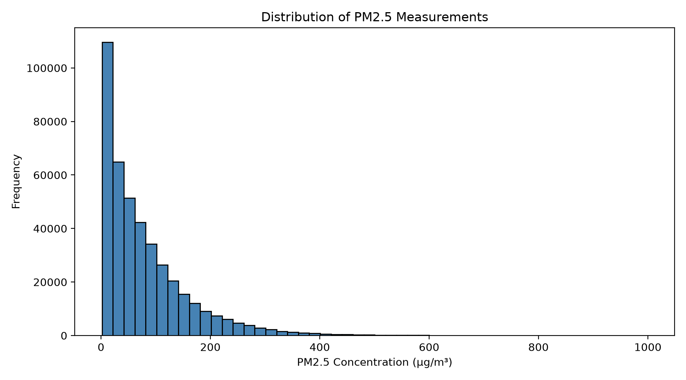
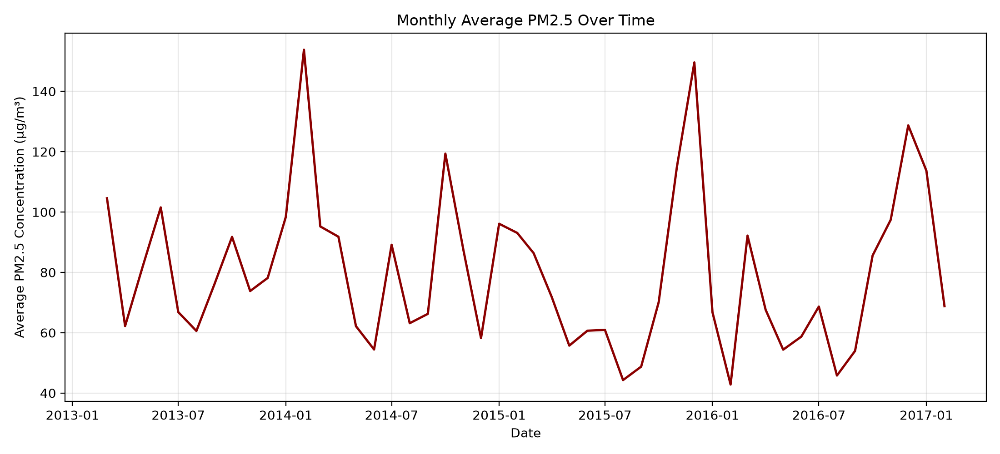
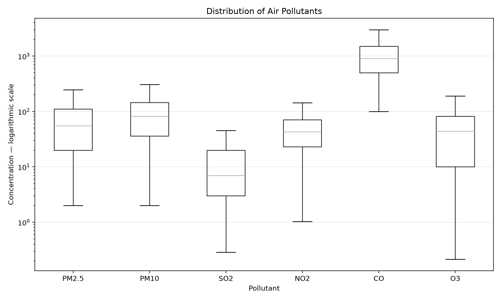

# Week 3 - Activity 3: Beijing Air Quality Statistical Analysis

## Activity overview

This activity develops a statistical data analysis project using the Beijing Multi-Site Air Quality dataset. The analysis combines data from 12 monitoring stations, investigates and cleans missing values, calculates descriptive statistics, compares average pollution levels between stations, creates visualisations, and examines correlations between PM2.5 and other environmental variables.

Dataset source: [UCI Machine Learning Repository - Beijing Multi-Site Air Quality](https://archive.ics.uci.edu/dataset/501/beijing+multi+site+air+quality+data)

## Dataset description

The combined dataset contains hourly air-quality and weather observations collected between 1 March 2013 and 28 February 2017.

- Rows: 420,768
- Original columns: 18
- Monitoring stations: 12
- Pollution variables: PM2.5, PM10, SO2, NO2, CO and O3
- Weather variables: temperature, pressure, dew point, rainfall, wind direction and wind speed

The individual station CSV files were combined using `combine_datasets.py`. A `datetime` column was then constructed from the separate year, month, day and hour columns.

## Data cleaning

The initial inspection identified missing values in the pollutant and weather measurements.

| Variable | Missing values | Missing percentage |
|---|---:|---:|
| PM2.5 | 8,739 | 2.08% |
| PM10 | 6,449 | 1.53% |
| SO2 | 9,021 | 2.14% |
| NO2 | 12,116 | 2.88% |
| CO | 20,701 | 4.92% |
| O3 | 13,277 | 3.16% |
| TEMP | 398 | 0.09% |
| PRES | 393 | 0.09% |
| DEWP | 403 | 0.10% |
| RAIN | 390 | 0.09% |
| wd | 1,822 | 0.43% |
| WSPM | 318 | 0.08% |

Numerical missing values were filled using linear interpolation separately within each monitoring station. This uses surrounding hourly observations from the same station and prevents values from one station being used to fill another station's records. Missing wind-direction values were categorical, so they were replaced with the most frequent wind direction for the corresponding station.

Rows were not removed because the missing percentages were relatively low and the other information in those rows remained useful. After cleaning, no missing values remained.

## Basic descriptive statistics

| Variable | Mean | Median | Minimum | Maximum | Standard deviation |
|---|---:|---:|---:|---:|---:|
| PM2.5 | 79.84 | 55.0 | 2.00 | 999.0 | 80.95 |
| PM10 | 104.91 | 82.0 | 2.00 | 999.0 | 92.43 |
| SO2 | 15.91 | 7.0 | 0.29 | 500.0 | 21.90 |
| NO2 | 50.60 | 43.0 | 1.03 | 290.0 | 35.17 |
| CO | 1,235.68 | 900.0 | 100.00 | 10,000.0 | 1,161.79 |
| O3 | 57.24 | 44.0 | 0.21 | 1,071.0 | 57.14 |
| TEMP | 13.53 | 14.5 | -19.90 | 41.6 | 11.44 |
| PRES | 1,010.75 | 1,010.4 | 982.40 | 1,042.8 | 10.47 |
| DEWP | 2.48 | 3.0 | -43.40 | 29.1 | 13.80 |
| RAIN | 0.06 | 0.0 | 0.00 | 72.5 | 0.82 |
| WSPM | 1.73 | 1.4 | 0.00 | 13.2 | 1.25 |

For PM2.5 and PM10, the means are higher than the medians. This indicates positively skewed distributions in which a relatively small number of very high pollution readings raise the averages. CO also has a large standard deviation, showing considerable variation in its recorded concentration. The median rainfall is zero, meaning that at least half of the hourly observations recorded no rain.

The complete results are available in [basic_statistics.csv](outputs/basic_statistics.csv).

## Average pollution by station

The dataset was grouped by station to calculate the mean value of each pollutant. Dongsi recorded the highest average PM2.5 concentration at **86.14 µg/m³**, while Dingling recorded the lowest at **66.85 µg/m³**.

Other notable results include:

- Gucheng had the highest average PM10 concentration at 119.26 µg/m³.
- Wanshouxigong had the highest average CO concentration at 1,373.62 µg/m³.
- Wanliu had the highest average NO2 concentration at 65.67 µg/m³.
- Dingling had the highest average O3 concentration at 70.53 µg/m³.

The full station comparison is available in [station_pollution_averages.csv](outputs/station_pollution_averages.csv).

## Visualisations

### PM2.5 distribution



The PM2.5 histogram is strongly positively skewed. Most observations occur at lower concentrations, while a smaller number of extremely high measurements form a long right-hand tail. This explains why the mean PM2.5 value is higher than its median.

### PM2.5 over time



Monthly average PM2.5 fluctuated considerably between 2013 and 2017. Higher concentrations frequently occurred during colder periods, while lower concentrations were generally observed during warmer periods. This suggests a seasonal pattern, although the graph does not prove that season or temperature directly caused the changes.

### Pollutant boxplots



The boxplots compare the medians and variation of the six pollutants. A logarithmic vertical scale was used because CO concentrations are substantially larger than the other measurements. CO has the highest concentration scale, SO2 has the lowest median, and the pollutants show different degrees of variability. Extreme points were hidden from the graph to improve readability, but they were not removed from the dataset or statistical calculations.

## Correlation analysis

Pearson correlation was used to measure the strength and direction of linear relationships between PM2.5 and the other numerical variables.

| Variable | Correlation with PM2.5 | Interpretation |
|---|---:|---|
| PM10 | 0.879 | Strong positive |
| CO | 0.780 | Strong positive |
| NO2 | 0.664 | Moderate-to-strong positive |
| SO2 | 0.478 | Moderate positive |
| WSPM | -0.271 | Weak negative |
| O3 | -0.150 | Weak negative |
| TEMP | -0.132 | Weak negative |
| DEWP | 0.113 | Weak positive |
| PRES | 0.020 | Almost no linear relationship |
| RAIN | -0.014 | Almost no linear relationship |

PM10 has the strongest relationship with PM2.5, with a correlation coefficient of **0.879**. This means that PM2.5 generally increases when PM10 increases. CO and NO2 also have notable positive relationships with PM2.5.

Temperature has a weak negative correlation of **-0.132** with PM2.5. Higher temperatures are therefore slightly associated with lower PM2.5 measurements, but temperature alone explains little of the variation. Correlation measures association and does not establish causation.

The complete matrix is available in [correlation_matrix.csv](outputs/correlation_matrix.csv).

## Conclusion

The analysis found that Beijing's hourly pollution data contains positively skewed pollutant measurements and substantial variation over time and between stations. Dongsi had the highest average PM2.5 concentration, and the monthly results suggest seasonal fluctuations. PM10 was the variable most strongly correlated with PM2.5, while temperature had only a weak negative relationship with PM2.5.

The findings should be interpreted with care. Interpolation produces estimates rather than observed measurements, correlation does not demonstrate causation, and city-wide monthly averages can hide short-term events and differences between individual stations.

## Files

- `combine_datasets.py` - combines the 12 original station CSV files.
- `beijing_air_quality_combined.csv` - combined source dataset.
- `air_quality_analysis.py` - performs cleaning, statistics, filtering, visualisation and correlation analysis.
- `outputs/basic_statistics.csv` - descriptive statistical results.
- `outputs/station_pollution_averages.csv` - mean pollution levels by station.
- `outputs/correlation_matrix.csv` - Pearson correlation matrix.
- `outputs/pm25_histogram.png` - PM2.5 distribution.
- `outputs/pm25_over_time.png` - monthly PM2.5 time series.
- `outputs/pollutant_boxplot.png` - pollutant comparison.

## Running the analysis

From the repository root, activate the virtual environment and run:

```powershell
.\.venv\Scripts\Activate.ps1
python .\week3\activity3\air_quality_analysis.py
```

Close any generated CSV files in Excel before rerunning the program because Excel may lock open files and prevent Python from overwriting them.
