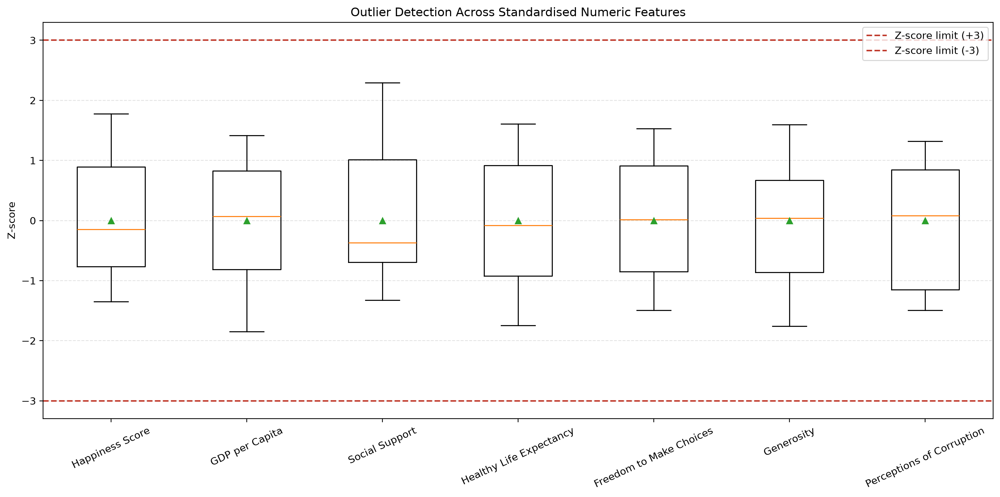

# Week 4 Activity 1.2: Happiness Dashboard and Outlier Detection Report

## 1. Purpose

This report explains the analysis and visualisations developed for the Week 4
Happiness Dashboard activity. The objectives were to:

1. Identify and display the three happiest countries.
2. Compare their Happiness scores with appropriate visualisations.
3. Summarise the Freedom score of the country with the lowest Happiness score.
4. Demonstrate Matplotlib and Plotly visualisation skills.
5. Explore how other dataset features relate to Happiness.
6. Detect outliers using the IQR and Z-score methods taught in class.
7. Explain whether flagged records should be retained or removed.

## 2. Dataset and validation

The analysis uses the cleaned `world_happiness_dataset.csv` supplied for the
activity.

| Measure | Result |
|---|---:|
| Countries | 20 |
| Columns | 8 |
| Missing values | 0 |
| Duplicate rows | 0 |
| Mean Happiness score | 5.17 |
| Mean Freedom score | 0.66 |

The dataset was validated with Pandas before analysis. All analytical columns
were numeric, and no removal or imputation was required.

## 3. Outlier detection and record decision

Two methods from the class presentation were applied independently to every
numeric feature.

### IQR method

The Interquartile Range method is robust for skewed distributions:

1. Calculate the first quartile (Q1) and third quartile (Q3).
2. Calculate `IQR = Q3 - Q1`.
3. Calculate the lower fence: `Q1 - 1.5 × IQR`.
4. Calculate the upper fence: `Q3 + 1.5 × IQR`.
5. Flag values outside these fences.

### Z-score method

The Z-score method measures distance from the mean in standard-deviation units:

1. Calculate the mean and population standard deviation.
2. Calculate `Z = (X - mean) / standard deviation`.
3. Flag a value when `|Z| > 3`.

The Z-score rule is most appropriate for approximately normal distributions.
Because this dataset is small and normality is not guaranteed, the IQR result is
treated as the more robust check, while Z-scores provide a second verification.

### Outlier results

| Feature | IQR outliers | Z-score outliers | Largest absolute Z-score | Most extreme country |
|---|---:|---:|---:|---|
| Happiness Score | 0 | 0 | 1.779 | Canada |
| GDP per Capita | 0 | 0 | 1.848 | Canada |
| Social Support | 0 | 0 | 2.292 | France |
| Healthy Life Expectancy | 0 | 0 | 1.746 | New Zealand |
| Freedom to Make Choices | 0 | 0 | 1.528 | Canada |
| Generosity | 0 | 0 | 1.759 | Norway |
| Perceptions of Corruption | 0 | 0 | 1.492 | Finland |

No value lies outside an IQR fence, and no absolute Z-score exceeds 3. France's
Social Support value is the most statistically extreme observation, but its
absolute Z-score of 2.292 remains below the class threshold.

### Keep or drop decision

**Decision: keep all 20 records.** No record meets either outlier definition,
and there is no evidence of a measurement or data-entry error. Removing a valid
extreme value would reduce an already small dataset and could distort its means,
rankings, and correlations. Even if a future record is flagged, it should first
be reviewed for data quality and real-world plausibility rather than deleted
automatically. A genuine unusual observation can contain important information.

The audit is saved in:

- `outputs/outlier_detection_summary.csv`
- `outputs/outlier_records.csv`
- `outputs/outlier_reviewed_dataset.csv`
- `outputs/outlier_detection.html`

## 4. Methodology

### Pandas aggregation

Records were grouped by `Country`, and the mean `Happiness_Score` was calculated
for each group. The three largest aggregated values were selected with
`nlargest()`. Although the supplied dataset has one record per country, this
method remains correct if multiple observations per country are added later.

### SQL verification

The Pandas result was checked with an in-memory SQLite query using:

- `AVG(Happiness_Score)`
- `GROUP BY Country`
- `ORDER BY Average_Happiness_Score DESC`
- `LIMIT 3`

Both methods produced the same top-three ranking.

### Correlation analysis

The feature ranking uses the Pearson correlation coefficient. Pearson
correlation measures the direction and strength of a linear association on a
scale from -1 to +1. Correlation describes association and does not establish
causation.

### Composite feature score

The non-Happiness features were min-max normalised and combined with equal
weights. Perceived corruption was reversed so that a lower corruption value
contributes positively. This score is exploratory and is not a predictive
model.

## 5. Key results

| KPI | Country | Value |
|---|---|---:|
| Highest Happiness score | Canada | 7.34 |
| Second-highest Happiness score | Brazil | 6.98 |
| Third-highest Happiness score | Finland | 6.67 |
| Lowest Happiness score | South Africa | 3.53 |
| Freedom score of least-happy country | South Africa | 0.90 |
| Dataset-average Freedom score | All countries | 0.66 |

Canada scores 0.36 points above Brazil and 0.67 points above Finland. South
Africa's Freedom score is approximately 0.24 above the dataset average despite
having the lowest Happiness score.

## 6. Visual results and interpretation

### 6.1 Three happiest countries

The bar chart is the most appropriate primary chart because countries are
discrete categories and Happiness is numeric. All bars share a zero baseline,
making differences easy to compare. The scatter subplot provides a compact view
of the same ranking.

A pie chart would incorrectly suggest that the scores are parts of a whole. A
line chart would imply a continuous or chronological sequence that the countries
do not have.

### 6.2 Feature relationships

The static dashboard contains four views:

1. **Happiness versus Freedom:** Freedom is on the horizontal axis and Happiness
   is on the vertical axis. Bubble size represents GDP per capita, while colour
   represents perceived corruption. The dispersed observations show that
   Freedom alone does not explain Happiness.
2. **Feature correlation ranking:** positive bars show features that tend to
   increase with Happiness, while negative bars show inverse relationships.
3. **Freedom summary:** South Africa has a Freedom score of 0.90, above the
   dataset average of 0.66, despite having the lowest Happiness score.
4. **Composite comparison:** the scattered relationship between the composite
   feature score and actual Happiness shows that the equal-weight index does not
   closely reproduce the observed ranking.

### 6.3 Interactive dashboard

[Open the unified interactive dashboard](outputs/happiness_dashboard.html)

The Plotly dashboard combines:

- KPI cards for Canada, Brazil, and Finland.
- A top-three comparison bar chart.
- South Africa's Freedom indicator gauge.
- An interactive multivariable bubble chart.
- A feature-correlation ranking.
- A standardised outlier-detection boxplot with Z-score thresholds.
- Country-level hover details.

## 7. How features relate to Happiness

| Feature | Pearson correlation | Interpretation |
|---|---:|---|
| Perceptions of corruption | -0.343 | The strongest observed relationship. Higher perceived corruption tends to occur with lower Happiness, but the association is still relatively weak. |
| Healthy life expectancy | 0.160 | Longer healthy life expectancy is associated with slightly higher Happiness. |
| Generosity | -0.146 | Generosity has a weak negative association in this sample. The unexpected direction may reflect the small dataset. |
| Freedom to make choices | 0.083 | Freedom has only a very small positive linear relationship with Happiness. |
| Social support | 0.022 | There is almost no linear relationship with Happiness. |
| GDP per capita | 0.014 | There is almost no linear relationship with Happiness in this dataset. |

Perceived corruption has the largest absolute correlation with Happiness, while
healthy life expectancy has the largest positive correlation. None of the
features has a strong linear relationship with Happiness.

## 8. Feature-based country ranking

The equal-weight composite feature score does not closely reproduce the actual
Happiness ranking. India ranks first on the exploratory feature index but only
thirteenth by actual Happiness. Finland is closer, ranking fourth on the feature
index and third by Happiness.

This difference shows that the available features and equal-weight assumptions
do not provide a reliable Happiness prediction.

## 9. Conclusion

Canada, Brazil, and Finland are the three happiest countries in the supplied
dataset. South Africa demonstrates that a high Freedom score does not
necessarily correspond to high Happiness. Perceived corruption has the strongest
observed association with Happiness, but all relationships are weak.

The outlier audit found no observations outside the 1.5×IQR fences and no
absolute Z-scores above 3. All records were therefore retained for the dashboard
analysis.

The results suggest that Happiness is multidimensional and cannot be explained
by a single feature in this sample. The dashboard is suitable for exploratory
comparison, not causal inference or prediction.

## 10. Limitations

- The dataset contains only 20 countries.
- There is only one observation per country, so trends over time cannot be
  analysed.
- Pearson correlation captures linear relationships only.
- Z-score detection assumes an approximately normal distribution.
- Outlier thresholds are statistical rules and do not replace contextual review.
- Correlation does not prove causation.
- The composite score uses subjective equal weights.
- Results apply only to the supplied dataset and should not be generalised to
  all countries.
