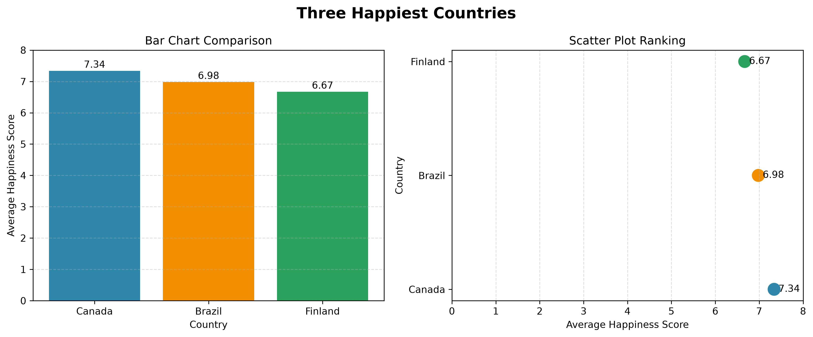
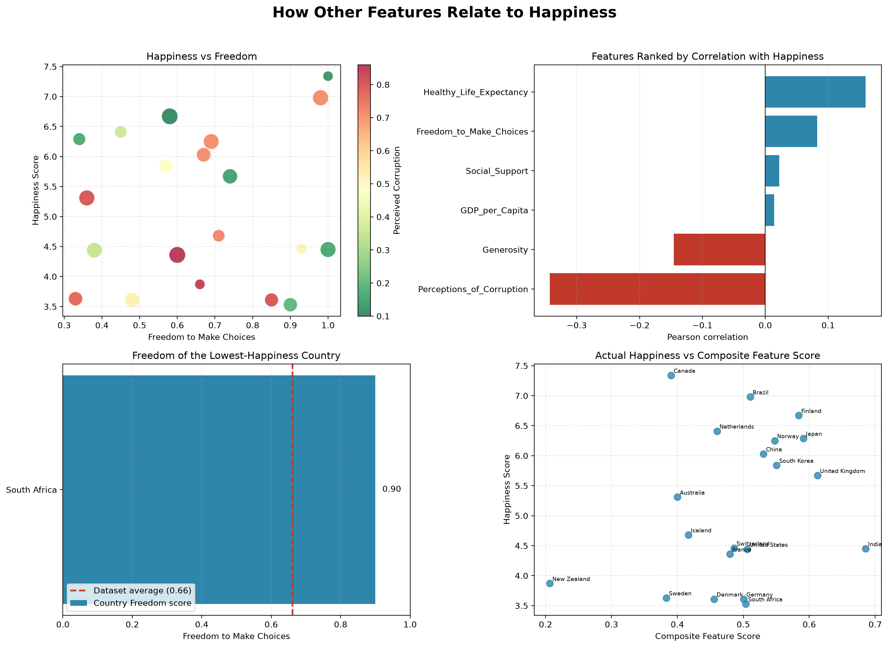

# Week 4 Activity 1: Happiness Dashboard and Data Visualisation

This project analyses the cleaned `world_happiness_dataset.csv` dataset with
Pandas and SQLite, then creates static Matplotlib and interactive Plotly
visualisations.

## How to run

From the repository root:

```powershell
python .\week4\activity\activity1\happiness_dashboard.py
```

Or from this activity folder:

```powershell
python .\happiness_dashboard.py
```

Install the required packages if needed:

```powershell
python -m pip install -r requirements.txt
```

The script generates all static and interactive outputs, then opens one unified
Plotly dashboard in the browser. All generated files are saved in the `outputs`
directory.

## Interactive dashboard

[Open the unified Happiness dashboard](outputs/happiness_dashboard.html)

The dashboard brings the main findings into one view: three headline country
scores, the top-three comparison, South Africa's Freedom gauge, the interactive
multivariable bubble chart, and the feature-correlation ranking.

## Approach

1. Load the cleaned CSV with Pandas.
2. Check its dimensions, missing values, and duplicate rows.
3. Group records by country and calculate the mean Happiness score.
4. Select the three largest aggregated scores using Pandas `nlargest()`.
5. Repeat the aggregation with an in-memory SQLite query using `AVG`,
   `GROUP BY`, `ORDER BY`, and `LIMIT`.
6. Compare the top three countries with Matplotlib and Plotly bar and scatter
   subplots.
7. Find the country with the lowest mean Happiness score and display its
   Freedom score with a Plotly indicator gauge.
8. Explore Happiness, Freedom, GDP, and perceived corruption with an
   interactive bubble chart.
9. Rank features by Pearson correlation with Happiness and construct an
   exploratory, equal-weight country feature index.

## Main findings

- Canada has the highest Happiness score: **7.34**.
- Brazil is second: **6.98**.
- Finland is third: **6.67**.
- South Africa has the lowest Happiness score: **3.53**.
- South Africa's Freedom score is **0.90**, compared with the dataset average
  of approximately **0.66**.
- Perceptions of corruption has the strongest observed relationship with
  Happiness, with a Pearson correlation of approximately **-0.343**.
- The relationships are generally weak, so the feature-based ranking does not
  closely reproduce the observed Happiness ranking.

## Visual results

### Three happiest countries



The common zero baseline in the bar chart shows that Canada has the highest
score (7.34), followed by Brazil (6.98) and Finland (6.67). The dot plot repeats
the comparison with less visual ink and makes the ordering clear.

### Relationships between Happiness and other features



The feature dashboard combines four related views:

1. **Happiness versus Freedom:** each country is a bubble, GDP per capita
   controls bubble size, and perceived corruption controls colour. The points
   are widely dispersed, indicating that Freedom alone does not explain the
   differences in Happiness.
2. **Feature correlation ranking:** positive values indicate that Happiness
   tends to increase as a feature increases; negative values indicate that it
   tends to decrease. Bar length represents relationship strength.
3. **Lowest-country Freedom summary:** South Africa has the lowest Happiness
   score (3.53), but its Freedom score (0.90) is above the dataset average
   (approximately 0.66). This is evidence that high Freedom does not necessarily
   produce high Happiness in this sample.
4. **Composite feature comparison:** the equal-weight feature score is compared
   with actual Happiness. The scattered pattern and ranking differences show
   that the selected features do not combine into a strong Happiness predictor
   in this small dataset.

## How the individual features relate to Happiness

| Feature | Correlation with Happiness | Interpretation in this dataset |
|---|---:|---|
| Perceptions of corruption | -0.343 | The strongest observed relationship. Countries with higher perceived corruption tend to have lower Happiness, although the relationship is only moderate-to-weak. |
| Healthy life expectancy | 0.160 | Countries with longer healthy life expectancy tend to be slightly happier. The relationship is weak. |
| Generosity | -0.146 | Higher Generosity values are associated with slightly lower Happiness in this sample. The weak and unexpected direction may reflect the small or synthetic dataset. |
| Freedom to make choices | 0.083 | Freedom has a very small positive relationship with Happiness. South Africa is an important example of high Freedom combined with low Happiness. |
| Social support | 0.022 | There is almost no linear relationship with Happiness in these 20 observations. |
| GDP per capita | 0.014 | GDP per capita has almost no linear relationship with Happiness in this particular dataset. |

These correlations describe association rather than effect or causation. A
positive correlation does not prove that increasing a feature will cause
Happiness to increase. Similarly, a negative value does not prove that the
feature reduces Happiness. The results apply only to the provided 20-country
dataset.

## Why a bar chart is the most appropriate chart

A bar chart is the best primary chart for comparing the three happiest
countries because countries are discrete categories and Happiness score is a
numeric measurement. Bars share a common zero baseline, making the differences
between Canada, Brazil, and Finland easy to compare. The scatter subplot provides
a less cluttered view of the same ranking. A pie chart would incorrectly imply
that the scores are parts of a whole, while a line chart would imply a continuous
or chronological sequence that the countries do not have.

The indicator gauge is appropriate for the Freedom summary because it displays
one country's value on the known 0-to-1 scale and compares it with the dataset
average. The bubble chart is exploratory: it relates Freedom to Happiness while
encoding GDP as bubble size and perceived corruption as colour.

## Output files

- `happiness_dashboard.html`: main unified interactive dashboard.
- `matplotlib_top_three.png`: static bar and scatter subplot.
- `plotly_top_three.html`: interactive bar and scatter subplot.
- `lowest_country_freedom.html`: Freedom indicator gauge.
- `happiness_freedom_bubble.html`: four-variable bubble chart.
- `feature_ranking.html`: correlations between each feature and Happiness.
- `country_feature_ranking.html`: feature index versus actual Happiness.
- `country_feature_ranking.csv`: country ranks and scores.
- `feature_relationships_dashboard.png`: static feature summary embedded above.

## Limitations

The dataset contains only 20 countries and one record per country. Correlation
does not establish causation. The composite feature score uses equal weights and
reverses perceived corruption so that lower corruption contributes positively;
it should be treated as an exploratory index rather than a predictive model.
