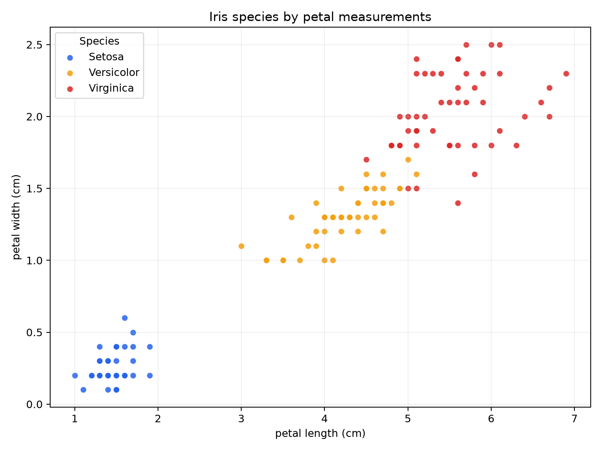
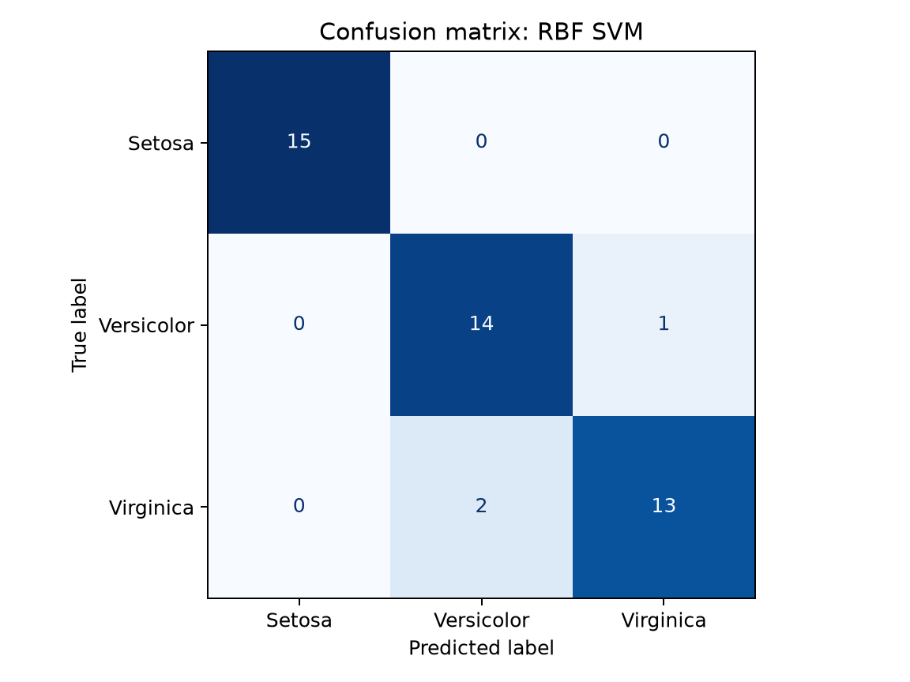

v# Week 5 Activity 1 - Iris SVM

This activity loads the supplied UCI Iris dataset, visualises petal measurements,
trains SVM classifiers with `fit()`, changes only the kernel to compare linear,
RBF, polynomial and sigmoid models, and evaluates the recommended model with
accuracy, a classification report and a confusion matrix.

The implementation follows the official
[scikit-learn Support Vector Machines documentation](https://scikit-learn.org/stable/modules/svm.html).
The documentation describes `SVC` as a classifier that accepts training features
`X` and class labels `y`, learns with `fit()`, predicts new classes with
`predict()`, supports different kernel functions, and handles multiclass
classification internally using a one-versus-one strategy.

From the repository root, run:

```powershell
.\.venv\Scripts\Activate.ps1
python .\week5\activity\activity1\svm_iris_activity.py
```

Generated plots and the kernel comparison table are saved in the `outputs` folder.

## Dataset and split

- Total observations: 150
- Features: sepal length, sepal width, petal length and petal width
- Classes: Setosa, Versicolor and Virginica (50 observations each)
- Missing values: none
- Training set: 105 observations (70%)
- Test set: 45 observations (30%)
- Split method: shuffled and stratified with `random_state=42`

Feature scaling is performed inside a scikit-learn pipeline using
`StandardScaler`. This prevents information from the test set leaking into the
training process.

## Kernel comparison

The teacher's controlled experiment was followed: the train/test split,
standardisation and default SVC settings remain unchanged, and only `kernel` is
changed. Five-fold cross-validation on the training set provides an additional
reliability check.

| Kernel | CV accuracy | Test accuracy | Fixed parameters |
|---|---:|---:|---|
| RBF | 97.1% | 93.3% | `C=1`, `gamma="scale"` |
| Linear | 97.1% | 91.1% | `C=1`, `gamma="scale"` |
| Sigmoid | 92.4% | 91.1% | `C=1`, `gamma="scale"` |
| Polynomial | 90.5% | 86.7% | `C=1`, `gamma="scale"` |

## Recommended model

The recommended model is the **RBF SVM with the default `C=1` and
`gamma="scale"` settings**. RBF and linear produced the same five-fold
cross-validation accuracy, but RBF improved held-out test accuracy from 91.1%
to 93.3% while all other settings remained fixed.

```python
SVC(kernel="rbf")
```

The teacher's baseline linear model produced the expected Versicolor row: 14
correctly predicted as Versicolor and 1 incorrectly predicted as Virginica.

## Test results

- Overall accuracy: 93.3%
- Correct predictions: 42 out of 45
- Incorrect predictions: 3 out of 45
- Setosa: 15 out of 15 correctly classified
- Versicolor: 14 out of 15 correctly classified
- Virginica: 13 out of 15 correctly classified
- One Versicolor observation was predicted as Virginica
- Two Virginica observations were predicted as Versicolor

| Class | Precision | Recall | F1-score | Test observations |
|---|---:|---:|---:|---:|
| Setosa | 1.000 | 1.000 | 1.000 | 15 |
| Versicolor | 0.875 | 0.933 | 0.903 | 15 |
| Virginica | 0.929 | 0.867 | 0.897 | 15 |
| **Overall accuracy** |  |  | **0.933** | **45** |

## Data visualisation

The scatter plot uses petal length and petal width because these measurements
provide strong separation between the three Iris species. Setosa forms a clearly
separated group, while Versicolor and Virginica overlap slightly.



## Confusion matrix

The confusion matrix shows that the RBF SVM correctly classified every Setosa
observation. One Versicolor observation was classified as Virginica, while two
Virginica observations were classified as Versicolor.



## Generated outputs

- `outputs/iris_scatter_plot.png`
- `outputs/confusion_matrix.png`
- `outputs/kernel_comparison.csv`

## References

- Scikit-learn developers. [Support Vector Machines - scikit-learn 1.9.0 documentation](https://scikit-learn.org/stable/modules/svm.html).
- R. A. Fisher. *The use of multiple measurements in taxonomic problems* (1936),
  as identified in the supplied `iris.names` dataset documentation.
- Week 5 lecture: *Machine Learning Data Analysis - SVM IRIS*.
